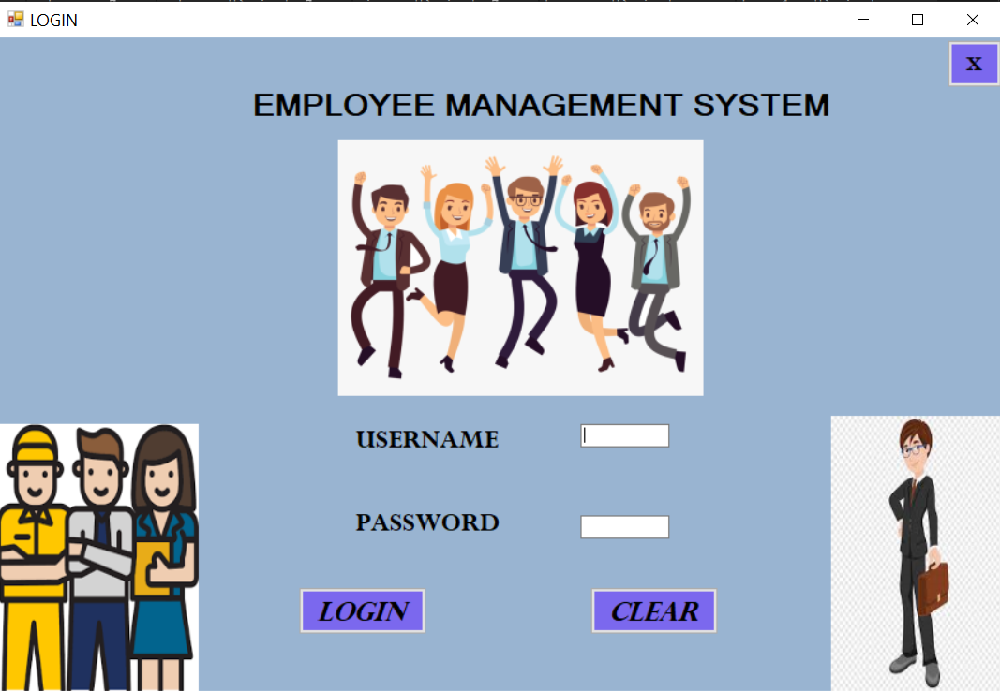
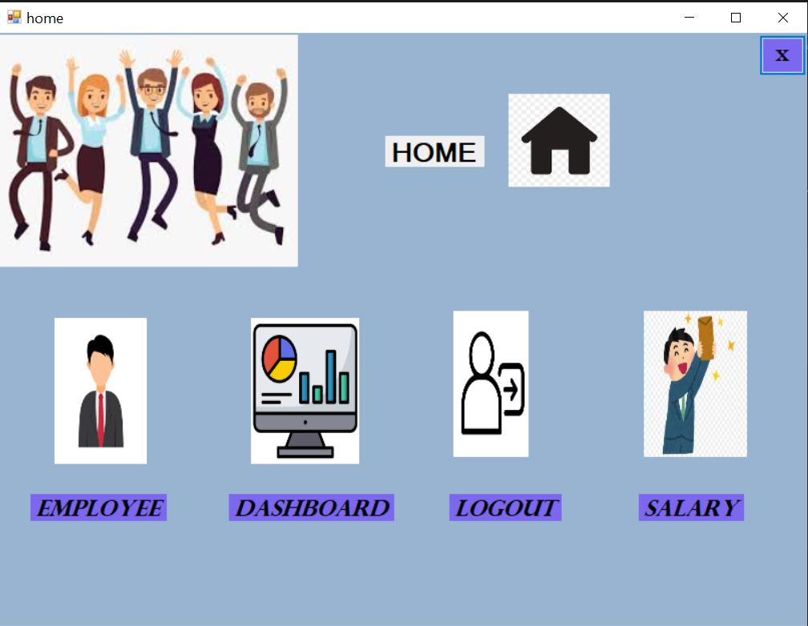
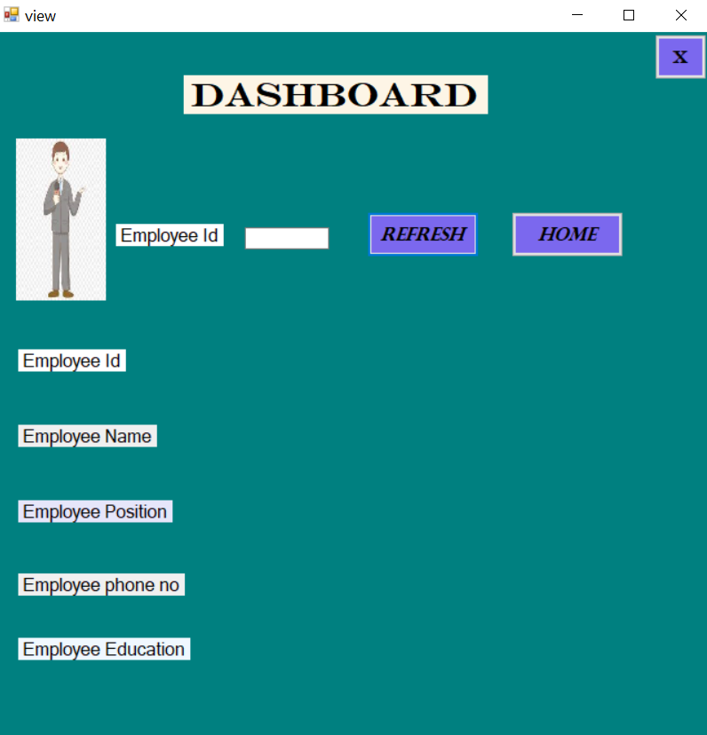
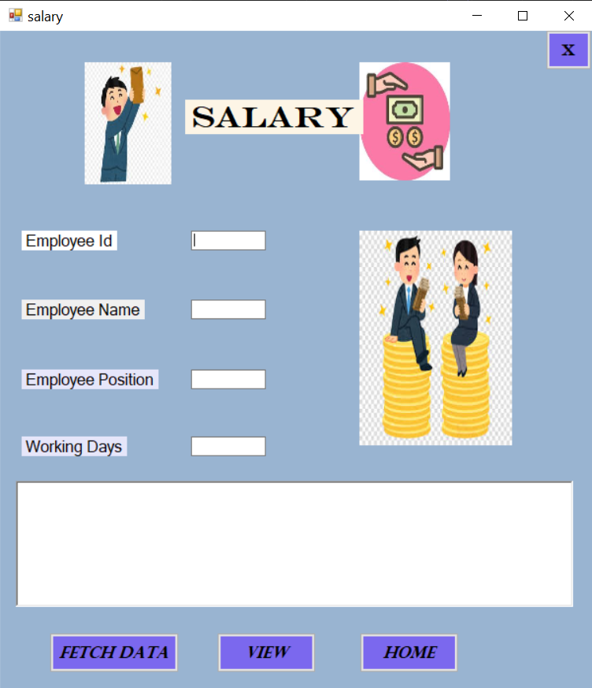
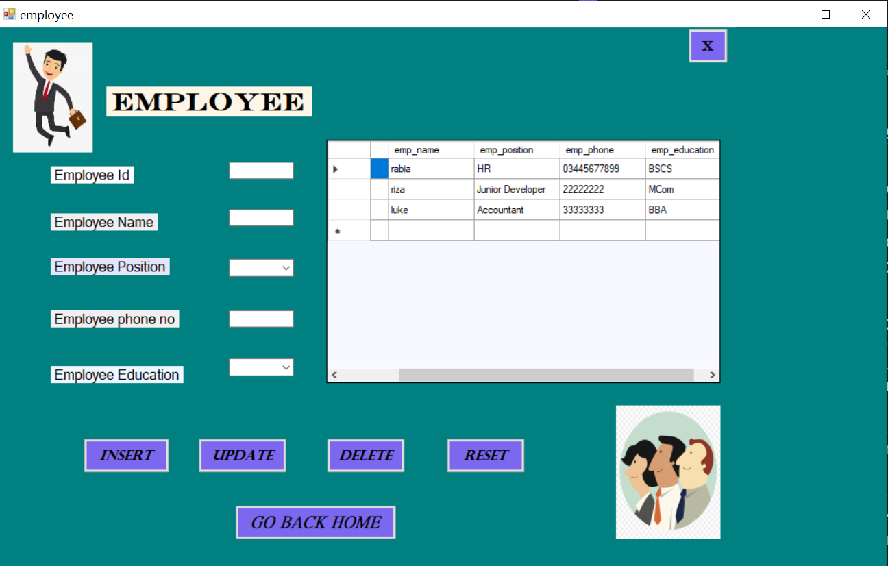

# Employee Management System 👨🏻‍💼

Welcome to the Employee Management System! 👩🏻‍💼

## Overview

The Employee Management System is a fun and functional project built with SQL database 💾 and C# in Visual Studio 🖥️. It's designed to help you manage your employees and their salaries 💼 with ease.

## Technologies

- **SQL Database**: Used for storing employee data and managing CRUD operations.💾
- **C#**: The primary programming language used for building the desktop application.🖥️
- **Visual Studio**: The integrated development environment (IDE) for designing, coding, and debugging the application.🛠️

## Features

- **CRUD Functionality**: Easily create, read, update, and delete employee records.📝
- **Employee Pictures**: Enjoy funny pics of your employees to add some fun to your day! 📸
- **Desktop Application**: Conveniently access and manage your employee data right from your desktop.🖥️

## Getting Started

To get started with the Employee Management System, follow these steps:

1. **Clone the Repository**: Clone this repository to your local machine.
2. **Open in Visual Studio**: Open the project in Visual Studio.
3. **Run the Application**: Build and run the application to start managing your employees!

 ## Screenshots

  
  
   
  

  

